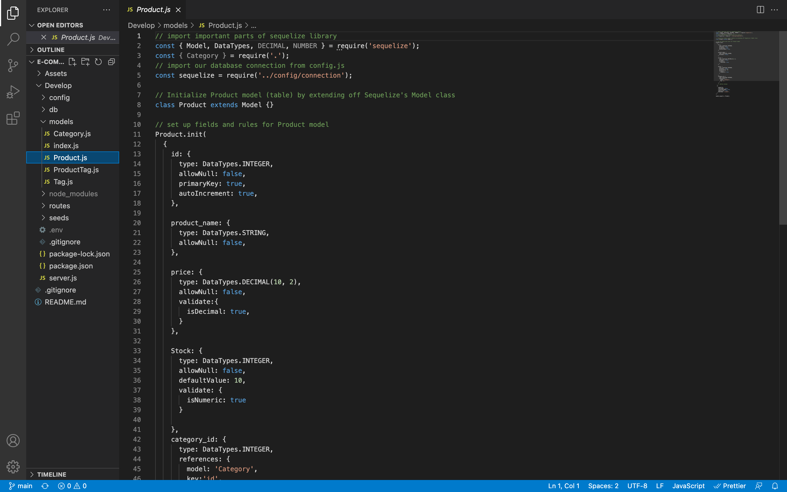
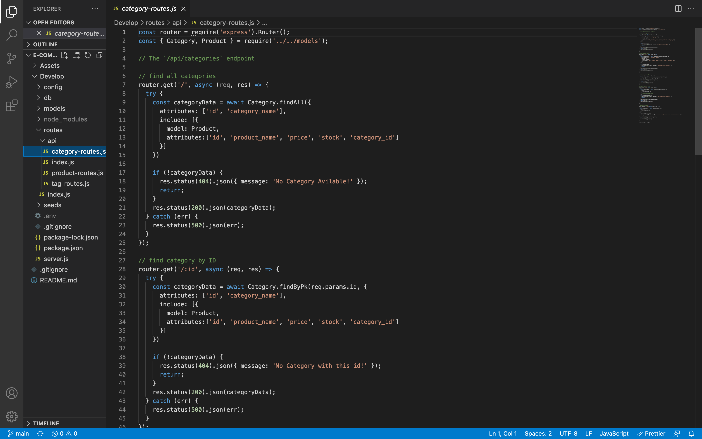

# E-Commerce Backend: Object-Relational Mapping
[](https://opensource.org/licenses/)
#### **Name:** Honore Nelson
#### **Github Repo:** https://github.com/matisses-goldfish/e-commerce
#### **URL:** backend application- no URL
---
    
##  Table of Contents:
* [Description](#description)
* [Acceptance Criteria](#acceptance-criteria)
* [Technologies Used](#technologies-used)
* [Walkthrough](#walkthrough)
* [Application](#application)
* [Installation](#installation)
* [Usage Information](#usage)
* [Testing Instructions](#testing)
* [Authors](#authors)
* [License](#license)
* [Question](#questions)


## Description:
---
Internet retail, also known as **e-commerce**, is the largest sector of the electronics industry, generating an estimated $29 trillion in 2019. E-commerce platforms like Shopify and WooCommerce provide a suite of services to businesses of all sizes. Due to their prevalence, understanding the fundamental architecture of these platforms will benefit you as a full-stack web developer.

My task was to build the back end for an e-commerce site by modifying starter code. I configured a working Express.js API to use Sequelize to interact with a MySQL database.

Because this application won’t be deployed, theres a walkthrough video provided bellow that demonstrates its functionality and all of the acceptance criteria being met. 

## Acceptance Criteria:
---
```md
GIVEN a functional Express.js API
WHEN I add my database name, MySQL username, and MySQL password to an environment variable file
THEN I am able to connect to a database using Sequelize
WHEN I enter schema and seed commands
THEN a development database is created and is seeded with test data
WHEN I enter the command to invoke the application
THEN my server is started and the Sequelize models are synced to the MySQL database
WHEN I open API GET routes in Insomnia for categories, products, or tags
THEN the data for each of these routes is displayed in a formatted JSON
WHEN I test API POST, PUT, and DELETE routes in Insomnia
THEN I am able to successfully create, update, and delete data in my database
```

## Technologies Used: 
- Express
- MySQL
- Sequelize
- Insomnia

## Walkthrough:
---
[](https://www.youtube.com/watch?v=PIoSTi4UfR4)

## Application:
---



## Installation:
---
    npm i
    node server.js


## Usage
---
Begin the application by pening your forking a repo, open in VS Code, and launch your integrated terminal. The type:

    nmp i

In order to installing the designated packes allowing this application to run. Then type:

    node server.js
Open Insomia and use your local host to view all category, tag, and product data. 

    
## Contribution Guidelines
---
Contribute using the Github Workflow model

    
## Authors
---
* **Honore Nelson** - *Initial work* - [E-Commerce](https://github.com/matisses-goldfish/e-commerce)
    
## License
---

This project is licensed under the  License - see the [LICENSE.md](LICENSE.md) file for details
<br></br>

## Question
---
Any additional question? 
### Contact me at:
* email: honoregn@gmail.com
* Github: matisses-goldfish
